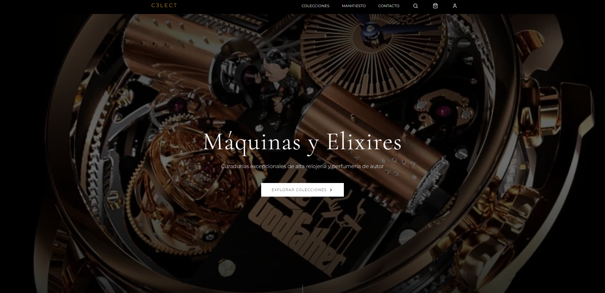
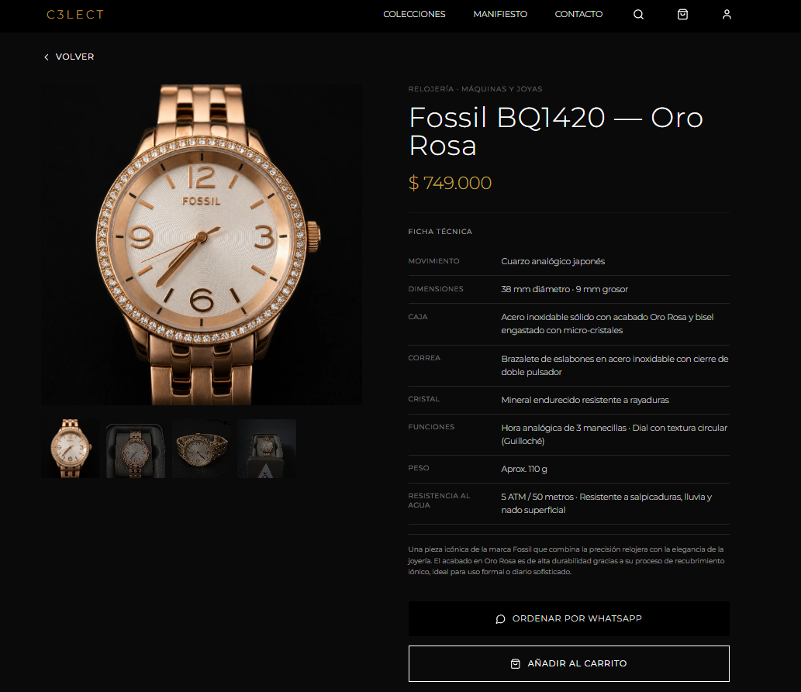

# Bóveda C3LECT

Catálogo digital de relojería y perfumería de alta gama. Es la tienda en línea de **C3LECT** — Medellín, Colombia.

🔗 **[Ver en vivo](https://cetremore26.github.io/boveda-c3lect-v2/)** · 🔐 **[API que la alimenta](https://github.com/cetremore26/c3lect-api)** · 📘 **[Docs de la API](https://c3lect-api.onrender.com/api/docs)**



<table>
<tr>
<td width="65%"></td>
<td width="35%"></td>
</tr>
</table>

---

## El problema

C3LECT vendía por WhatsApp: fotos sueltas, precios repetidos a mano en cada conversación, disponibilidad que solo existía en la cabeza del vendedor. Cada cliente nuevo obligaba a rearmar el catálogo desde cero, y no había forma de mostrar una marca premium enviando imágenes desordenadas por chat.

## La solución

Un catálogo web propio, sobrio y siempre actualizado. El cliente navega por su cuenta, filtra por lo que le interesa, ve stock real y llega a la conversación de venta ya decidido. El inventario se administra en un solo lugar y se refleja al instante en la tienda.

El catálogo se divide en dos líneas: **Máquinas y Joyas** (relojería) y **Firmas y Elixires** (perfumería).

---

## Funcionalidades

- Catálogo con filtros por categoría, marca, género y rango de precio
- Ficha de producto con especificaciones técnicas completas de relojería (movimiento, caja, correa, cristal, resistencia al agua, reserva de marcha) y pirámide olfativa para perfumería (notas de salida, corazón y fondo)
- Stock en vivo consultado a la API — el carrito no permite pedir más de lo disponible
- Checkout para invitados y para usuarios registrados
- Pago en línea vía MercadoPago
- Interfaz responsive con animaciones de Motion
- Panel de métricas con gráficas (Recharts)

---

## Stack

| Capa | Tecnología |
|---|---|
| Framework | React 18 + TypeScript |
| Build | Vite 6 |
| Estilos | Tailwind CSS 4 |
| Enrutamiento | React Router 7 |
| Animaciones | Motion (Framer Motion) |
| Gráficas | Recharts |
| Iconos | Lucide React |
| HTTP | Axios |
| Datos | Supabase + [C3LECT API](https://github.com/cetremore26/c3lect-api) |
| Deploy | GitHub Pages |

---

## Arquitectura

```
Bóveda (React SPA)
      │
      ├── Supabase ──────────► almacenamiento de imágenes de producto
      │
      └── C3LECT API ────────► catálogo · stock · pedidos · pagos
              │
              ├── PostgreSQL (Prisma)
              └── MercadoPago
```

---

## Puesta en marcha

```bash
pnpm install
cp .env.example .env    # completa las credenciales
pnpm dev                # http://localhost:5173
pnpm build               # build de producción
```

### Variables de entorno

| Variable | Para qué |
|---|---|
| `VITE_SUPABASE_URL` | URL del proyecto Supabase |
| `VITE_SUPABASE_ANON_KEY` | Clave pública de Supabase |
| `VITE_API_URL` | URL base de la C3LECT API |

---

## Licencia

MIT — ver [LICENSE](LICENSE).

Desarrollado por **Manuel Sebastián Cetre** · [GitHub](https://github.com/cetremore26) · cetremore@gmail.com
